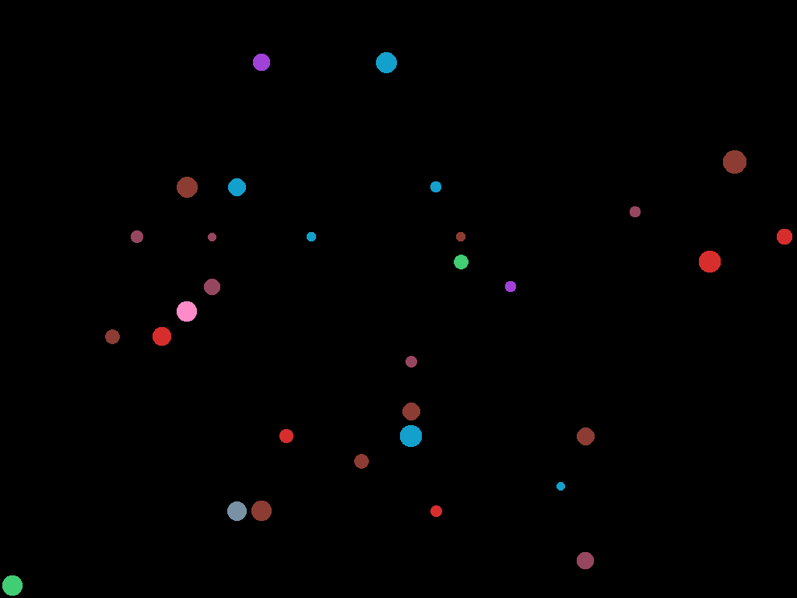

# Qt Procedural Generation
Procedural generation which uses the Qt/C++ framework. It is largely based on this [repository](https://github.com/OneLoneCoder/Javidx9/blob/master/PixelGameEngine/SmallerProjects/OneLoneCoder_PGE_ProcGen_Universe.cpp).

## Screenshots

